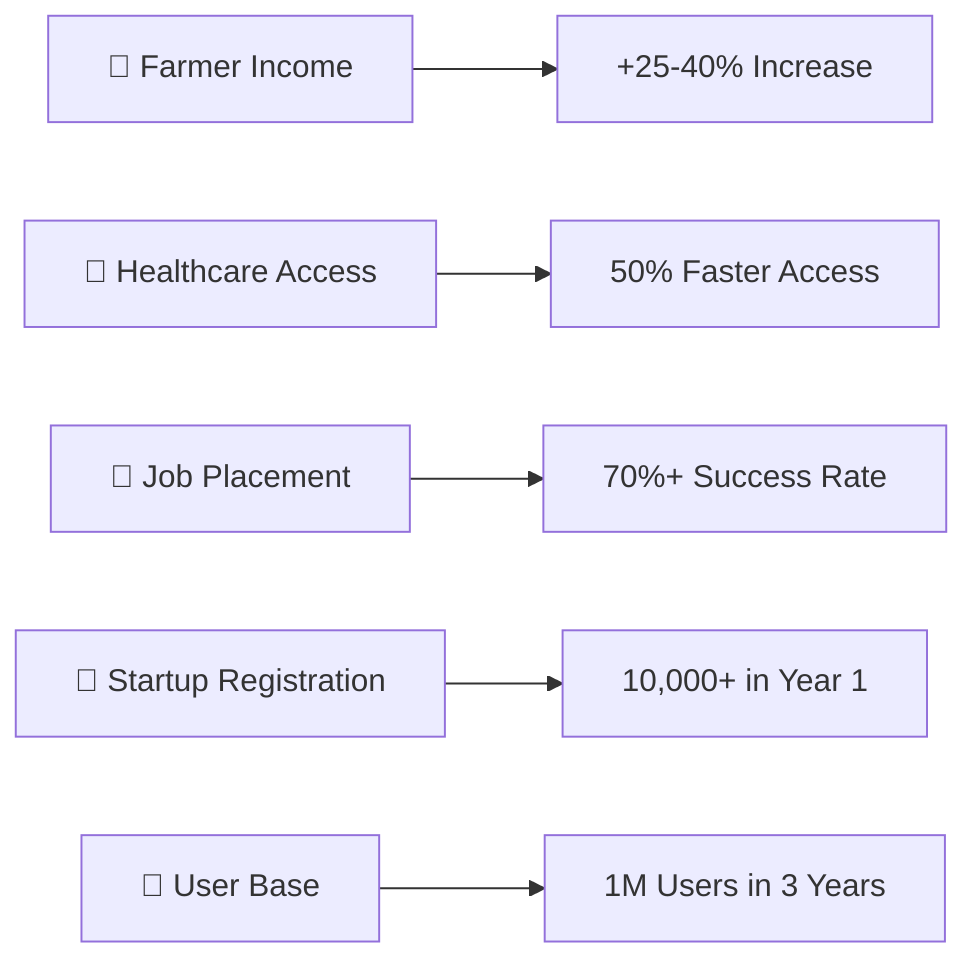

# 🌾 Rural Digital Empowerment Platform
## 📋 Requirements Document

---

<div align="center">

**Bridging the Digital Divide for Rural India**

*A comprehensive AI-powered ecosystem connecting rural communities with essential services*

[](https://github.com)
[](https://github.com)
[](https://github.com)

</div>

---

## 📚 Table of Contents

<div align="center">

| 🎯 **Core Sections** | 📊 **Technical Details** | 🔧 **Implementation** |
|:---:|:---:|:---:|
| [🎯 Project Overview](#-1-project-overview) | [⚙️ Functional Requirements](#️-2-functional-requirements) | [🛠️ Technology Stack](#️-6-technology-stack) |
| [⚠️ Problem & Solution](#️-12-problem-statement) | [📈 Non-Functional Requirements](#-3-non-functional-requirements) | [🖥️ Hardware Requirements](#️-7-hardware-requirements) |
| [👥 Target Users](#-target-users) | [📥 Input Requirements](#-4-input-requirements) | [⚠️ Constraints](#-8-constraints-and-limitations) |
| [🎯 Success Criteria](#-success-criteria) | [📤 Output Requirements](#-5-output-requirements) | [📋 Document Control](#document-control) |

</div>

---

## 🎯 1. Project Overview

<table>
<tr>
<td width="50%">

### 📖 Project Description
The Rural Digital Empowerment Platform is a **comprehensive AI-powered digital ecosystem** designed to bridge the gap between rural communities and essential services. 

**🔗 Key Integration Points:**
- 🌾 Agriculture market intelligence
- 🏥 Healthcare services  
- 💼 Employment opportunities
- 🚀 Startup guidance
- 🏛️ Government scheme access

**📱 Multi-Channel Access:**
- 📞 Voice calls (IVR)
- 📱 Mobile applications  
- 💻 Web portals

</td>
<td width="50%">

### ⚠️ Problem Statement

> **Rural communities in India face significant barriers:**

```
❌ Limited market information access
❌ Healthcare service gaps  
❌ Employment opportunity awareness
❌ Startup guidance unavailability
❌ Government scheme complexity
❌ Digital literacy challenges
```

**💡 Our Solution:** One unified platform addressing all these challenges through AI-powered assistance in local languages.

</td>
</tr>
</table>

### 👥 Target Users

<div align="center">

| 👨‍🌾 **Primary Users** | 👩‍⚕️ **Secondary Users** | 🌍 **Geographic Scope** |
|:---:|:---:|:---:|
| Farmers | Doctors | Rural India |
| Rural families | Government officials | (Initial: Maharashtra) |
| Students | Corporate buyers | Expandable pan-India |
| Healthcare seekers | Training institutes | Mixed literacy levels |
| Aspiring entrepreneurs | - | Multilingual needs |

</div>

### 🎯 Success Criteria

<div align="center">



</div>

## ⚙️ 2. Functional Requirements

> **What the system MUST do - Core Features & Capabilities**

---

### 👤 2.1 User Management & Authentication

<details>
<summary><b>🔐 Click to expand Authentication Features</b></summary>

| ID | Requirement | Priority | Status |
|:---:|:---|:---:|:---:|
| **FR1** | 📱 Phone number + OTP authentication | 🔴 High | ✅ |
| **FR2** | 👤 Multi-demographic profile creation | 🔴 High | ✅ |
| **FR3** | 🔄 Cross-channel session management | 🟡 Medium | ⏳ |
| **FR4** | 🌐 Multi-language support (5 languages) | 🔴 High | ✅ |
| **FR5** | 🎭 Role-based access control | 🟡 Medium | ⏳ |

</details>

### 🌾 2.2 Agriculture & Market Intelligence

<details>
<summary><b>📊 Click to expand Agriculture Features</b></summary>

<table>
<tr>
<td width="50%">

**🏪 Market Integration**
- **FR6** 📈 Real-time government API prices
- **FR7** 🏢 Corporate buyer integration  
- **FR8** 🚛 Transportation cost calculation
- **FR9** ⚖️ Multi-platform price comparison

</td>
<td width="50%">

**🤝 Farmer Services**
- **FR10** 💡 Optimal selling recommendations
- **FR11** 🔗 Direct buyer connections
- **FR12** 🌱 Krishi Kendra integration
- **FR13** 🌤️ Weather-based advisory

</td>
</tr>
</table>

**🎯 Key Benefits:**
```
✅ Eliminate middlemen exploitation
✅ Maximize farmer profits  
✅ Real-time market intelligence
✅ Weather-informed decisions
```

</details>

### 🏥 2.3 Healthcare Services

<details>
<summary><b>⚕️ Click to expand Healthcare Features</b></summary>

| Feature Category | Requirements | AI Integration |
|:---|:---|:---:|
| **🩺 Symptom Analysis** | FR14-FR16: Voice/text input, AI diagnosis, test recommendations | 🤖 |
| **💳 Insurance Integration** | FR17-FR18: Ayushman Bharat, CGHS eligibility, provider networks | 📋 |
| **🏥 Healthcare Access** | FR19-FR21: Telemedicine booking, emergency guidance, medical records | 🔒 |

**🎯 Healthcare Impact:**
```
🗣️ Symptom Input → 🤖 AI Analysis → 📋 Hypothesis → 🏥 Provider Match → 💳 Insurance → 📅 Booking
```

</details>

### 💼 2.4 Employment & Skill Development

<details>
<summary><b>🎓 Click to expand Employment Features</b></summary>

<div align="center">

| 🔍 **Skill Assessment** | 🎯 **Job Matching** | 📚 **Learning Path** |
|:---:|:---:|:---:|
| FR22: Gap analysis | FR23-FR24: AI matching | FR25: Course recommendations |
| Current skill evaluation | Portal integration | NSDC/PMKVY programs |
| Market demand analysis | Startup connections | Certification tracking |

</div>

**📈 Career Development Pipeline:**
```
Student Profile → Skill Assessment → Gap Analysis → Learning Recommendations → Job Matching → Application Support
```

</details>

### 2.5 Startup & Entrepreneurship Support
- **FR30**: System shall provide step-by-step business registration guidance
- **FR31**: System shall validate startup ideas through market research
- **FR32**: System shall connect entrepreneurs with funding schemes and investors
- **FR33**: System shall provide patent and copyright registration guidance
- **FR34**: System shall recommend required skills based on business ideas
- **FR35**: System shall facilitate student-startup job connections
- **FR36**: System shall provide legal compliance and documentation support

### 2.6 Government Scheme Integration
- **FR37**: System shall search and match eligible government schemes
- **FR38**: System shall check scheme eligibility based on user profile
- **FR39**: System shall provide document checklists for scheme applications
- **FR40**: System shall track application status and provide updates
- **FR41**: System shall integrate with Digital India portal and state government systems

### 2.7 Multi-Channel Access
- **FR42**: System shall provide IVR-based voice interface with natural language processing
- **FR43**: System shall support mobile applications (Android/iOS) with offline capabilities
- **FR44**: System shall provide responsive web portal for desktop and mobile browsers
- **FR45**: System shall send SMS alerts and notifications for critical updates
- **FR46**: System shall support WhatsApp integration for communication

### 2.8 AI & Intelligence Features
- **FR47**: System shall process natural language queries in multiple Indian languages
- **FR48**: System shall provide personalized recommendations based on user behavior
- **FR49**: System shall learn from user interactions to improve responses
- **FR50**: System shall maintain conversation context across sessions
- **FR51**: System shall provide intelligent routing based on user intent

## 3. Non-Functional Requirements

### 3.1 Performance Requirements
- **NFR1**: System shall respond to user queries within 2 seconds for 95% of requests
- **NFR2**: System shall support 10,000 concurrent users without performance degradation
- **NFR3**: System shall process voice-to-text conversion within 1 second
- **NFR4**: System shall complete API orchestration (multiple external calls) within 3 seconds
- **NFR5**: System shall maintain 99.9% uptime (maximum 8.76 hours downtime per year)

### 3.2 Scalability Requirements
- **NFR6**: System shall scale horizontally to support 1 million registered users
- **NFR7**: System shall handle 100,000 daily active users with auto-scaling
- **NFR8**: Database shall support 10TB of structured and unstructured data
- **NFR9**: System shall process 1 million API calls per day across all services

### 3.3 Security Requirements
- **NFR10**: All sensitive data shall be encrypted using AES-256 encryption at rest
- **NFR11**: All data transmission shall use TLS 1.3 encryption
- **NFR12**: System shall implement multi-factor authentication for admin access
- **NFR13**: Personal health information shall comply with healthcare data protection standards
- **NFR14**: System shall maintain audit logs for all user actions and data access
- **NFR15**: System shall implement rate limiting to prevent API abuse

### 3.4 Reliability Requirements
- **NFR16**: System shall have automated backup every 6 hours with 30-day retention
- **NFR17**: System shall implement disaster recovery with RTO of 4 hours and RPO of 1 hour
- **NFR18**: System shall have fallback mechanisms for all external API dependencies
- **NFR19**: System shall gracefully degrade functionality when services are unavailable

### 3.5 Usability Requirements
- **NFR20**: Voice interface shall support natural conversation with 95% accuracy
- **NFR21**: Mobile app shall work offline with core functionality available
- **NFR22**: System shall support users with basic literacy levels
- **NFR23**: Interface shall be accessible following WCAG 2.1 AA guidelines
- **NFR24**: System shall provide help and guidance for first-time users

### 3.6 Compatibility Requirements
- **NFR25**: Mobile app shall support Android 8.0+ and iOS 12.0+
- **NFR26**: Web portal shall support Chrome 90+, Firefox 88+, Safari 14+, Edge 90+
- **NFR27**: System shall integrate with existing government API standards
- **NFR28**: Voice interface shall work on basic feature phones and smartphones

## 4. Input Requirements

### 4.1 User Data Inputs
```
Required User Profile Fields:
- Phone Number (Primary Key): 10-digit Indian mobile number
- Name: Full name in preferred language
- Location: Village/District/State
- Age: Numeric value (16-80 years)
- Gender: Male/Female/Other
- Education Level: Illiterate/Primary/Secondary/Graduate/Post-Graduate
- Occupation: Farmer/Student/Business/Healthcare/Other
- Language Preference: Hindi/Marathi/English/Tamil/Kannada
- Family Size: Numeric value (1-20 members)
- Annual Income: Range selection (Below 2L/2-5L/5-10L/Above 10L)
```

### 4.2 Agriculture Data Inputs
```
Farmer-Specific Fields:
- Land Size: Numeric value in acres (0.1-1000)
- Crop Types: Multi-select from predefined list
- Farming Method: Organic/Conventional/Mixed
- Storage Capacity: Numeric value in quintals
- Transport Access: Yes/No/Limited
- Quality Certifications: List of certifications
- Preferred Buyers: Corporate/Local/Both
- Selling Quantity: Numeric value in kg/quintal
- Quality Grade: A/B/C grade selection
- Harvest Date: Date picker
```

### 4.3 Healthcare Data Inputs
```
Health-Related Fields:
- Symptoms: Text description or checklist selection
- Symptom Duration: Hours/Days/Weeks/Months
- Severity Level: Mild/Moderate/Severe/Critical
- Medical History: Encrypted text field
- Current Medications: List of medicines
- Allergies: Text description
- Insurance Details: Policy numbers and provider info
- Emergency Contacts: Name and phone numbers
- Preferred Hospital Type: Government/Private/Any
```

### 4.4 Employment Data Inputs
```
Job Seeker Fields:
- Current Skills: Multi-select from skill database
- Work Experience: Years of experience (0-50)
- Education Qualifications: Degree and institution details
- Preferred Job Type: Full-time/Part-time/Internship/Freelance
- Salary Expectations: Range selection
- Location Preference: Local/State/National/Remote
- Industry Interest: Technology/Agriculture/Healthcare/Finance/Other
- Availability: Immediate/1 month/3 months/6 months
```

### 4.5 External API Data Inputs
```
Government API Integration:
- AGMARKNET: Commodity prices, market data
- eNAM: Mandi rates, trader information
- Ayushman Bharat: Beneficiary verification data
- Digital India: Scheme information and eligibility
- Weather APIs: Location-based forecast data
- Corporate APIs: Real-time procurement rates
```

## 5. Output Requirements

### 5.1 Agriculture Outputs
```
Market Intelligence Reports:
- Real-time price comparison across platforms
- Net profit calculations with transportation costs
- Optimal selling recommendations with reasoning
- Weather impact analysis on crop prices
- Seasonal demand forecasting
- Buyer contact information and terms
- Quality improvement suggestions
- Storage vs immediate sale recommendations
```

### 5.2 Healthcare Outputs
```
Medical Assistance Results:
- AI-generated symptom analysis with probability scores
- List of possible medical conditions ranked by likelihood
- Recommended diagnostic tests with cost estimates
- Immediate care instructions and precautions
- Nearby healthcare provider list with distances
- Insurance eligibility status and coverage details
- Appointment booking confirmations
- Emergency contact information when needed
```

### 5.3 Employment Outputs
```
Job Matching Results:
- Personalized job recommendations with match scores
- Skill gap analysis with improvement suggestions
- Available training programs with duration and cost
- Auto-generated resume in multiple formats
- Interview preparation materials and tips
- Application tracking dashboard
- Salary benchmarking for roles
- Career progression pathways
```

### 5.4 Startup Support Outputs
```
Entrepreneurship Guidance:
- Step-by-step business registration checklist
- Market validation reports with competitor analysis
- Funding scheme recommendations with eligibility
- Required skill development roadmap
- Legal documentation templates
- Patent search results and filing guidance
- Investor network connection opportunities
- Student talent pool for hiring
```

### 5.5 Government Scheme Outputs
```
Scheme Matching Results:
- Eligible scheme list with benefit amounts
- Application process step-by-step guide
- Required document checklist with samples
- Application status tracking information
- Deadline alerts and reminders
- Benefit calculation and timeline
- Contact information for scheme offices
```

## 6. Technology Stack Requirements

### 6.1 Backend Technology
```
Core Backend:
- Programming Language: Node.js 18+ with TypeScript
- Web Framework: Express.js 4.x
- API Architecture: RESTful APIs with GraphQL for complex queries
- Authentication: JWT tokens with OAuth 2.0 for third-party integrations
- Process Management: PM2 for production deployment
```

### 6.2 Database Requirements
```
Data Storage:
- Primary Database: PostgreSQL 15+ for structured data
- Document Database: MongoDB 6+ for unstructured data and logs
- Cache Database: Redis 7+ for session management and API caching
- Search Engine: Elasticsearch 8+ for full-text search and analytics
- Data Warehouse: Apache Spark for big data processing
```

### 6.3 AI/ML Technology
```
Artificial Intelligence:
- Large Language Model: OpenAI GPT-4 (primary), Google Gemini Pro (backup)
- Speech Processing: Google Cloud Speech-to-Text and Text-to-Speech APIs
- ML Framework: TensorFlow 2.x for custom models
- Data Science: Python 3.10+ with Pandas, NumPy, Scikit-learn
- Model Management: MLflow for model versioning and deployment
```

### 6.4 Frontend Technology
```
User Interfaces:
- Mobile Apps: React Native 0.72+ for cross-platform development
- Web Application: React.js 18+ with Next.js 13+ framework
- Styling: Tailwind CSS with Material-UI components
- Voice Interface: Twilio Voice API with custom IVR flows
- Progressive Web App: Service workers for offline functionality
```

### 6.5 Infrastructure Requirements
```
Cloud Platform:
- Primary Cloud: Amazon Web Services (AWS)
- Containerization: Docker with Kubernetes orchestration
- CI/CD Pipeline: GitHub Actions with automated testing
- Monitoring: Prometheus + Grafana for metrics and alerting
- Security: AWS WAF, Let's Encrypt SSL, HashiCorp Vault
```

### 6.6 Integration Requirements
```
External Services:
- Communication: Twilio (SMS, Voice, WhatsApp), SendGrid (Email)
- Payments: Razorpay, PayU for transaction processing
- Maps: Google Maps API for location services
- Government APIs: Digital India, AGMARKNET, eNAM integration
- Corporate APIs: Blinkit, Flipkart, BigBasket procurement systems
```

## 7. Hardware Requirements

### 7.1 Production Environment
```
Server Specifications:
- Application Servers: 5 × AWS EC2 m5.xlarge instances
  - 4 vCPUs, 16 GB RAM, 100 GB SSD per instance
- AI Processing Servers: 3 × AWS EC2 c5.2xlarge instances
  - 8 vCPUs, 16 GB RAM, GPU support for ML workloads
- Database Servers: AWS RDS Multi-AZ deployment
  - db.r5.2xlarge (8 vCPUs, 64 GB RAM)
- Cache Servers: AWS ElastiCache Redis cluster
  - 3 nodes, cache.r6g.large (2 vCPUs, 13 GB RAM)
```

### 7.2 Storage Requirements
```
Data Storage:
- Database Storage: 2 TB SSD with automatic scaling
- File Storage: 10 TB AWS S3 for documents and media
- Backup Storage: 5 TB for automated backups with 30-day retention
- CDN Storage: AWS CloudFront for global content delivery
```

### 7.3 Network Requirements
```
Connectivity:
- Bandwidth: 1 Gbps dedicated connection with 99.9% uptime
- Load Balancer: AWS Application Load Balancer with SSL termination
- API Gateway: AWS API Gateway for rate limiting and monitoring
- VPN Access: Secure admin access to production systems
```

### 7.4 Development Environment
```
Development Setup:
- Developer Machines: 16 GB RAM, 512 GB SSD minimum
- Local Development: Docker Desktop for containerized development
- Testing Environment: Staging servers mirroring production setup
- Version Control: Git with GitHub for code repository
```

## 8. Constraints and Limitations

### 8.1 Budget Constraints
```
Financial Limitations:
- Initial Development Budget: ₹2 crores ($240,000) for MVP development
- Monthly Operational Cost: ₹15 lakhs ($18,000) for infrastructure
- Annual Maintenance: ₹50 lakhs ($60,000) for updates and support
- Marketing Budget: ₹1 crore ($120,000) for user acquisition
```

### 8.2 Regulatory Constraints
```
Compliance Requirements:
- Data Protection: Digital Personal Data Protection Act 2023 compliance
- Healthcare Data: Medical data handling as per Indian healthcare regulations
- Financial Transactions: RBI guidelines for payment processing
- Government Integration: Adherence to Digital India standards
- Agricultural Data: APMC and agricultural marketing law compliance
```

### 8.3 Technical Constraints
```
Technology Limitations:
- API Rate Limits: Government APIs limited to 100 requests/minute
- Language Support: Initial support for 5 Indian languages only
- Offline Capability: Limited to 50MB local storage on mobile devices
- Voice Recognition: 95% accuracy target for Indian accents and dialects
- Internet Connectivity: Must work on 2G networks with graceful degradation
```

### 8.4 Operational Constraints
```
Business Limitations:
- Geographic Scope: Initial launch limited to 3 states (Maharashtra, Karnataka, Punjab)
- User Capacity: System designed for maximum 1 million concurrent users
- Support Hours: 24/7 automated support, human support 8 AM - 8 PM IST
- Language Localization: Content translation requires 2-week lead time
- Partner Integration: New corporate partnerships require 3-month integration cycle
```

### 8.5 Data Constraints
```
Information Limitations:
- Historical Data: Market price history limited to 2 years
- Real-time Updates: Price updates every 15 minutes (not real-time)
- Data Accuracy: Dependent on external API reliability (95% accuracy target)
- User Privacy: No sharing of personal data without explicit consent
- Data Retention: User data retained for 7 years as per legal requirements
```

### 8.6 Security Constraints
```
Safety Requirements:
- Medical Advice: System provides guidance only, not medical diagnosis
- Financial Transactions: All payments processed through certified gateways
- Data Encryption: All sensitive data encrypted with industry standards
- Access Control: Role-based access with audit trails
- Vulnerability Management: Monthly security audits and penetration testing
```

---

## 📋 Document Control

<div align="center">

| 📄 **Document Info** | 👥 **Team** | 📅 **Timeline** |
|:---:|:---:|:---:|
| **Version**: 1.0 | **Prepared By**: Development Team | **Created**: February 14, 2026 |
| **Status**: ✅ Active | **Approved By**: Project Stakeholders | **Last Updated**: February 14, 2026 |
| **Type**: Requirements Specification | **Reviewed By**: Technical Architects | **Next Review**: March 14, 2026 |

</div>

---

### 📝 Change Log

<details>
<summary><b>📋 Click to view version history</b></summary>

| Version | Date | Changes | Author |
|:---:|:---:|:---|:---:|
| **1.0** | Feb 14, 2026 | 🎉 Initial requirements document creation | Development Team |
| **1.1** | *Future* | 🔄 Requirement updates and stakeholder feedback | TBD |
| **2.0** | *Future* | 🚀 Phase 2 feature requirements | TBD |

</details>

---

<div align="center">

**🌾 Rural Digital Empowerment Platform**

*Empowering Rural India through Technology*

---

**📞 Contact Information**
- 📧 Email: team@ruralempowerment.in
- 🌐 Website: www.ruralempowerment.in
- 📱 Support: 1800-XXX-XXXX

---

*© 2026 Rural Digital Empowerment Platform. All rights reserved.*

</div>